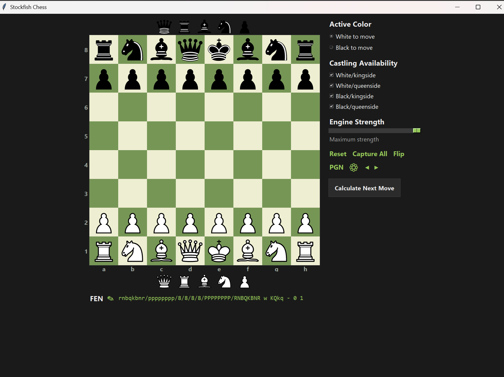

# Stockfish Chess

A modern desktop chess GUI built around the Stockfish engine. Play against
Stockfish at any strength, get move suggestions, analyse positions, and
edit positions freely. Drop-in installer downloads the right Stockfish build
for your CPU on first run.



## Features

- **Play or analyse**: drag, click-click, or have Stockfish play moves
  automatically.
- **Suggested moves are clickable**: `Calculate Next Move` shows the engine's
  pick in a bordered box; click it to play that move.
- **Multi-PV**: see the top 1-4 candidate moves side by side.
- **Play style**: Aggressive (favours captures + checks), Balanced, or
  Defensive (prefers quiet moves + castling). Bias never costs real evaluation.
- **Human mode**: adds opening development bias, recapture instinct, and a
  light check/castling preference so moves look like a person picked them.
- **Position editor**: drag pieces from the side palettes, edit FEN, set
  castling rights, flip the board.
- **Engine settings**: strength (1320-3200 ELO), think time (0.1-60s, type
  any value), Syzygy tablebases path.
- **Smooth piece animations** with an ease-out curve.

## Quick start

Requires **Python 3.10+** on Windows, macOS, or Linux. You don't need to
download Stockfish yourself; the app does that on first run.

```bash
git clone https://github.com/TiltedLunar123/stockfish-chess.git
cd stockfish-chess
pip install -r requirements.txt
python main.py
```

On first launch, the install dialog detects your OS + CPU, picks the most
optimised Stockfish build it can guarantee will run, and downloads it from
the official Stockfish GitHub releases. Pick the recommended option for the
fastest engine, or override with a different build from the dropdown.

If you already have a Stockfish binary, click **Use existing file…** in the
install dialog and point it at that file. On Windows that's the `.exe`; on
macOS and Linux the official builds have no extension, and the app expects the
executable bit to be set on them.

## Engine builds

The installer picks among these based on your CPU's instruction-set support:

| Build | Requires | Notes |
|------|---------|------|
| `vnni512`       | AVX-512 VNNI | Fastest on Cascade Lake+ |
| `avx512icl`     | AVX-512 (Ice Lake) | |
| `avx512`        | AVX-512 | |
| `avxvnni`       | AVX-VNNI | Alder Lake+ (12th-gen Intel) |
| `bmi2`          | BMI2 + AVX2 | Most common modern pick |
| `avx2`          | AVX2 | Haswell+ |
| `sse41-popcnt`  | SSE4.1 + POPCNT | Older systems |
| `x86-64`        | none | Generic fallback, slowest |
| `m1-apple-silicon` | Apple Silicon | Mac M1/M2/M3/M4 |

You can also install a Stockfish build from the CLI:

```bash
python -m chess_gui.installer              # install recommended
python -m chess_gui.installer --list       # list builds for your OS
python -m chess_gui.installer --build bmi2 # install a specific build
```

Installed binaries land in `./stockfish/` and show up in the Engine dropdown
inside the Settings panel.

## Controls

| Action | How |
|------|-----|
| Move a piece | Drag, or click source then destination |
| Remove a piece | Right-click it (or drag off the board) |
| Promote a pawn | A Q/R/B/N dialog appears (`q`/`r`/`b`/`n` keys also work) |
| Get a move suggestion | Click **Calculate Next Move**; click the suggested move box to play it |
| Cancel a long calculation | Click **Cancel** next to the spinner |
| Set position from FEN | Click the pencil icon next to the FEN string |
| Edit castling rights | Toggle the checkboxes in the sidebar |
| Flip the board | Click **Flip** in the sidebar |

## Settings

Click the ⚙ icon in the sidebar to open the inline settings panel. Sections:

- **Engine**: swap between installed Stockfish builds, install a new one,
  uninstall the selected one.
- **Engine strength**: ELO 1320 to 3200 (max).
- **Think time**: slider for 0.1-5s, or click the number to type any value
  up to 60s.
- **Multi-PV**: 1-4 candidate moves.
- **Play style**: Aggressive / Balanced / Defensive.
- **Options**: SAN notation, auto-play suggestion, click-to-move (vs drag),
  human mode.
- **Syzygy tablebases**: point at a folder of `.rtbw`/`.rtbz` files for
  perfect endgame play with 6 or fewer pieces.

## Project layout

```
.
├── main.py                  # entry point (first-run install + launch)
├── chess_gui/
│   ├── app.py               # main app: ties everything together
│   ├── board.py             # board canvas, drag/drop, animations
│   ├── engine.py            # Stockfish wrapper (threaded)
│   ├── installer.py         # CPU detection + GitHub release downloader
│   ├── install_dialog.py    # first-run install GUI
│   ├── settings_panel.py    # inline 2-column settings
│   ├── sidebar.py           # right-hand control panel
│   ├── palette.py           # piece palettes above/below board
│   ├── pieces.py            # SVG → PhotoImage cache
│   ├── fen_bar.py           # editable FEN display
│   ├── widgets.py           # shared themed widgets
│   └── theme.py             # colors, fonts, layout constants
├── stockfish/               # engine lives here (installer drops the binary in)
├── tests/                   # pytest suite for the pure logic
├── requirements.txt
├── pyproject.toml
└── README.md
```

## Running the tests

The suite covers the display-free logic: the build picker in `installer.py`
and the rating tiers, engine discovery, setter clamps, score formatting, and
play-style re-ranking in `engine.py`. It needs `python-chess` and `pytest` but
none of the GUI or rendering stack, so it runs anywhere.

```bash
pip install -e .[test]
pytest
```

CI runs the same suite on Python 3.10 through 3.12 on every push and pull
request.

## Credits

- [**Stockfish**](https://stockfishchess.org/): the chess engine doing the
  heavy lifting. GPL-3.
- [**python-chess**](https://python-chess.readthedocs.io/): board model and
  engine protocol.
- Piece graphics: SVG set rendered via [`resvg-py`](https://github.com/RazrFalcon/resvg)
  from python-chess's bundled Cburnett pieces.

## License

[MIT](LICENSE). Stockfish itself is GPL-licensed and is downloaded separately
at install time, not bundled in this repo.
